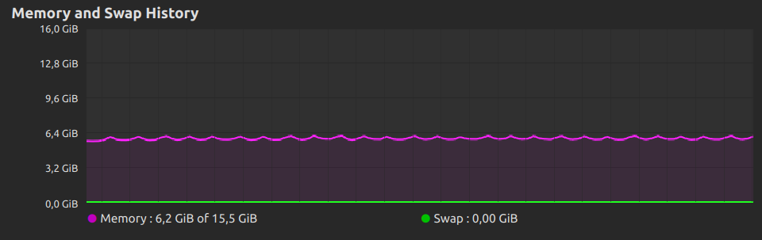
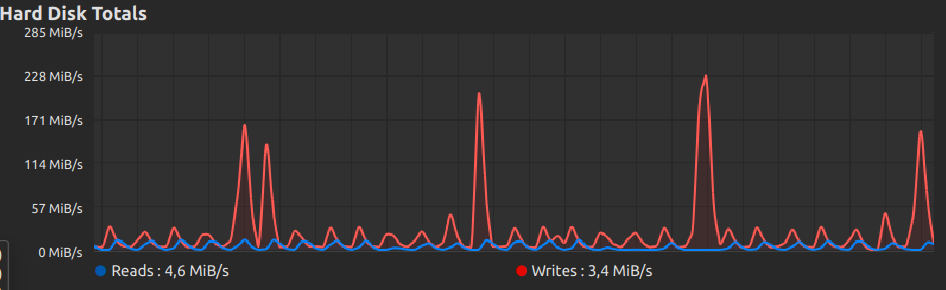

# This folder contains the result of the app work
* [result.csv](./result.csv) csv file with sql query results according to the individual task
* [profie_time.txt](./saved_profie_time_exec_values_count_733112_2020count_379299_2019count_353813.txt) and other similar files - local time measurments of app run
  * create_table - time spent on creating the table
  * copy_dataframe (first) - time spent on copying data from Odata2019File.csv (in general order doesn't allways be the same)
  * copy_dataframe (second) - time spent on copying data from Odata2020File.csv
  * get_min_phys_2019_2020 - time spent on getting task query
  * main() - all program work time


### Test machine specs:
```
OS: Arch Linux x86_64 
Kernel: 5.10.16-arch1-1
Docker-compose: version 1.28.4, build unknown
Docker:
  Client:
    Version:           20.10.3
    API version:       1.41
    Go version:        go1.15.7
  Server:
    Engine:
        Version:          20.10.3
        API version:      1.41 (minimum version 1.12)
        Go version:       go1.15.7
    containerd:
        Version:          v1.4.3
    runc:
        Version:          1.0.0-rc93
    docker-init:
        Version:          0.19.0
CPU:       Info: Quad Core model: Intel Core i5-8300H bits: 64 type: MT MCP L2 cache: 8 MiB 
           Speed: 874 MHz min/max: 800/4000 MHz
SSD: nvme0: Samsung model: MZVLB256HAHQ-000H1
RAM: total: 15.52 GiB
```
### Quick summary of testing database crash
Database and the python script were run by docker compose.
After some time a database was forcibly stopped by `docker kill database` command, command `docker stop database` was tested too but in that case, Docker tried to exit gracefully so that we can't really test the transaction commits.

The python script cached exception of the previous event and closed with code 0. The next run of it was much faster because it skipped already inserted blocks and continued to insert only absent records. Time lasted on running insert was 65.1881451 s that is much faster than insert with an empty database - 171.99037 s

### Time measurments
| condition                                         | insertion time (s) |
|---------------------------------------------------|--------------------|
| Final result. execute_values(size=32768)          | 171.99037          |
| Final result. execute_values(size=32768)          | 193.58297          |
| Final result. execute_values(size=32768)          | 196.25411          |
| Final result. execute_values(size=8192)           | 204.2308           |
| execute_values(size=32768) with prefilled tables  | 0.8813554          |
| execute_values(size=32768) after DB crash         | 52.5818539         |
| execute_values(size=32768) after DB crash         | 65.1881451         |
| Using COPY with make_csv and reencoding fixed csv | 384.4              |
| Using COPY with PK constraint. Page size 32768    | 417.5519           |

As we see changes in the iteration are almost twiсe effective as iterable reading from csv, replacing line wrong values, encoding into a streaming string and then using "fast" function COPY.

Thr difference in speed with different 'batch sizes' (size) not so big and size can be decreased (or increased) according to test stand characteristics. Size mostly affects memory usage.

Here you can see system monitor screenshots

#### Size = 8192


#### Size = 32768

