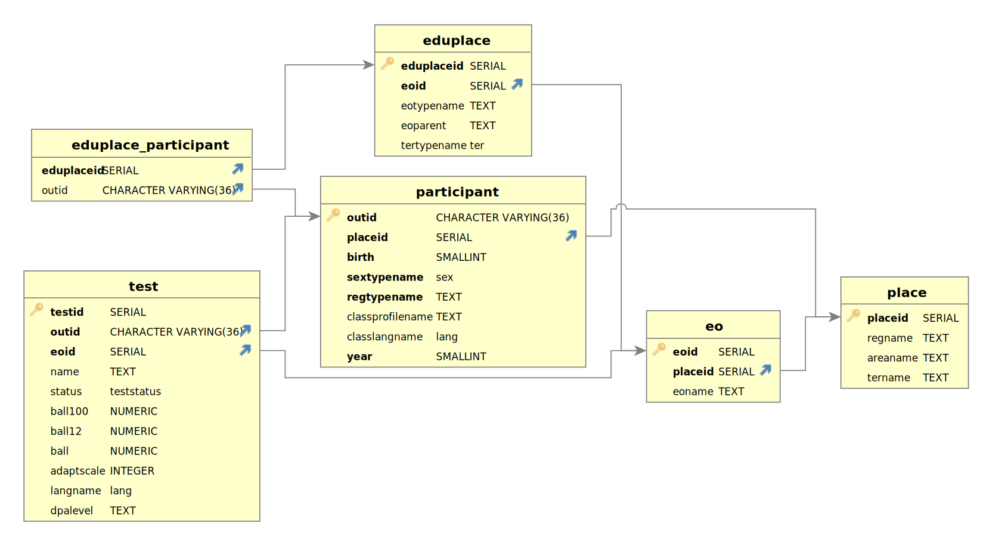

# Laboratory work 2

## Instalation guide

### Requirements

- ```docker-compose``` (tested on version 1.29.0)
- ```docker``` engine (tested on version 20.10.5)

### Setting up the environment

[.env](./.env.test) file with configuration environment variables

have to be the same as in [the previous Lab](../1Lab/)

to simply run you can just
``` bash
cp .env.test .env
```

### How to run
#### Step 1. Do [the previous Lab](../1Lab/):

Copy configurations if they were changed.

Then go to this folder and move to Step 2.

> The volume **`postgres`** from the previous Laboratory work will be used to populate the new tables. If it is absent, the new DB will be empty.

#### Step 2. Run all services via:

``` bash
docker-compose -f docker-compouse.yaml up --build
```

#### Result files will be in [`/output/`](./output/)

Tip: to rebuild only 1 service you need to
``` bash
docker-compose -f docker-compouse.yaml up --detach --build {service-name}
```

#### Translated condition in [`TASK.md`](./TASK.md)

#### ERD
##### Logical ERD

##### Physical ERD


Credits: Alana Thomas [Implementing Flyway with Docker
](https://heavylion.medium.com/implementing-flyway-with-docker-8ae256ce634f)
